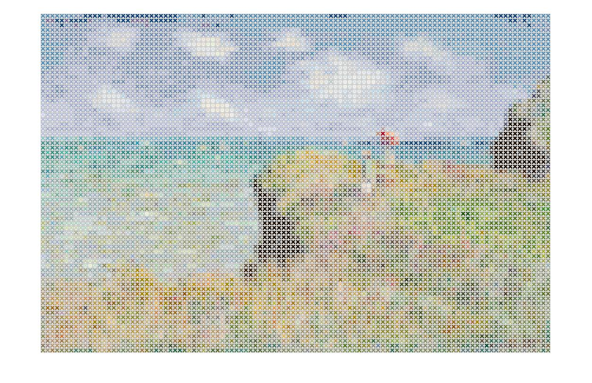
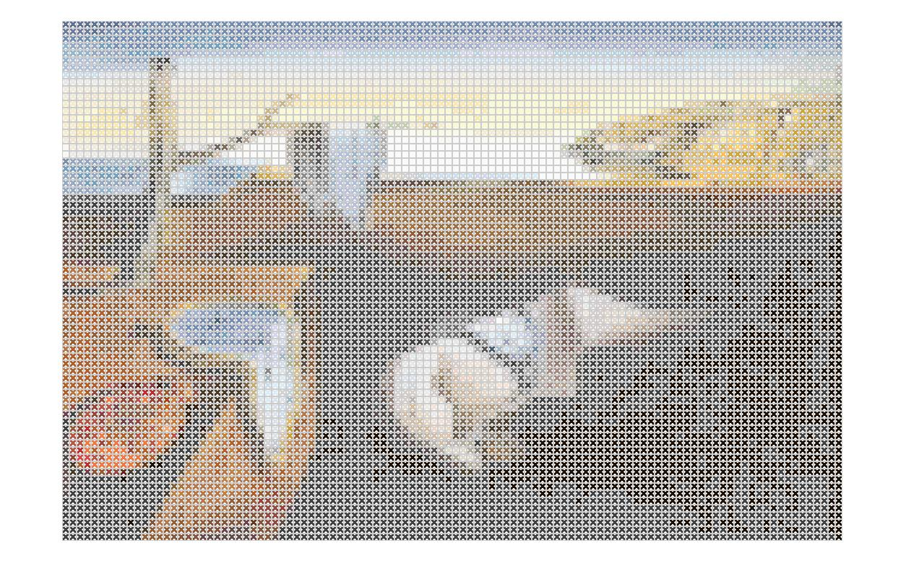
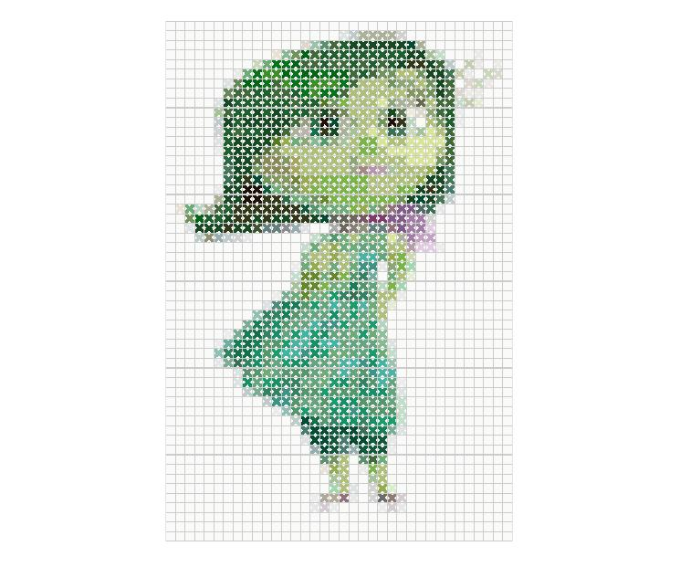
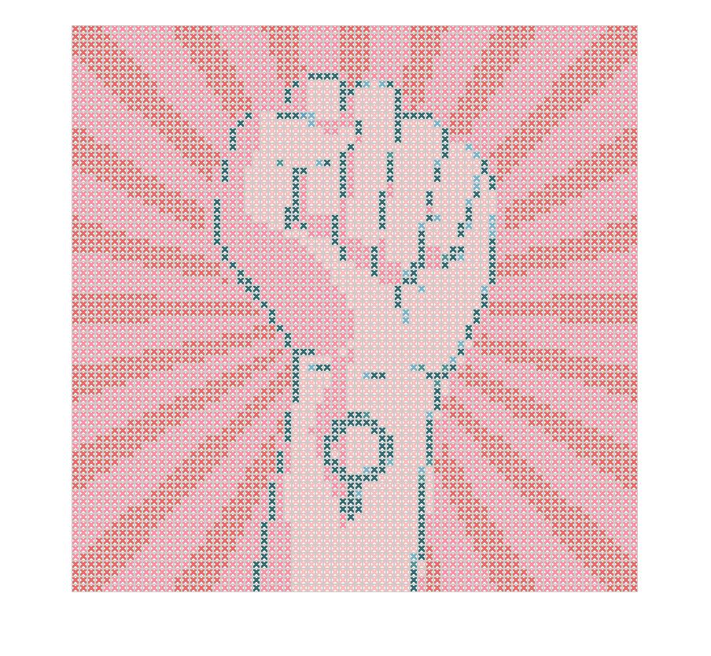

# Cross Stitch Generator
This is a Matlab program that converts an image into a cross stitch pattern and outputs the correct colors to buy for the yarn. The algorithm is based upon the 453 existing DMC colors and converts them into RGB and further into Lab-values in order to compare the color difference. The algorithm can produce 4 different kind of reproduction, one with a free choice among the 453 colors, one with a reduced database of 100 colors, one with a further reduced database of 50 colors and finally one that chooses colors from the 50 most occuring colors in the image. 

The project was conducted as part of the course 'Image Reproduction and Image Quality' (TNM097) at Linköping University, spring 2020. 

```
Requires image processing toolbox.
```

# Algorithm
The program reads in DMC color chart data from a csv-file (453 colors) and converts the RGB-values into CIELAB color space. The input image is looped through according to the set dimensions of the single cross stitch image. For each subarea of the image, the mean intensity value in CIELAB is calculated and the DMC color with closest euclidean distance to the mean intensity value is chosen to represent the color. The algorithm outputs the DMC colors to buy for the cross stitch pattern and some objective quality measures are calculated in order to compare the different optimizations, as described below, to eachother. 

## Optimization
The reducement of the color space is performed according to maximizing the internal euclidean distance among the separate colors and thereby getting one subset of 100 colors and one subset of 50 colors to span the color space. The optimization according to input image has a slightly higher computational time as it counts the occurrences of colors in the input image before choosing the 50 most occurring to reproduce the image with. The result with the different optimizations can be seen below: 


The top left image has been reproduced using the full set of DMC colors and uses 141 colors. The top right image has been reproduced using the subset of 100 colors and uses 29 colors. The down left image has been reproduced using the subset of 50 colors and uses 21 colors. The down right image has been reproduced using the 50 most occuring colors in the image and uses 35 colors. 

# Examples using the program

The following images has been generated with a cross stitch width of 10x10 pixels. 

## Monet, Cliff walk



## Salvador Dali, Persistence of memory



## Disgust from Inside Out



## Illustration



# Further work
An extension of the program in order to allow the user to set a flag for maximum amount of colors to use for reproduction is planned for, as is the task of creating a stand-alone application instead of an internal Matlab file.
