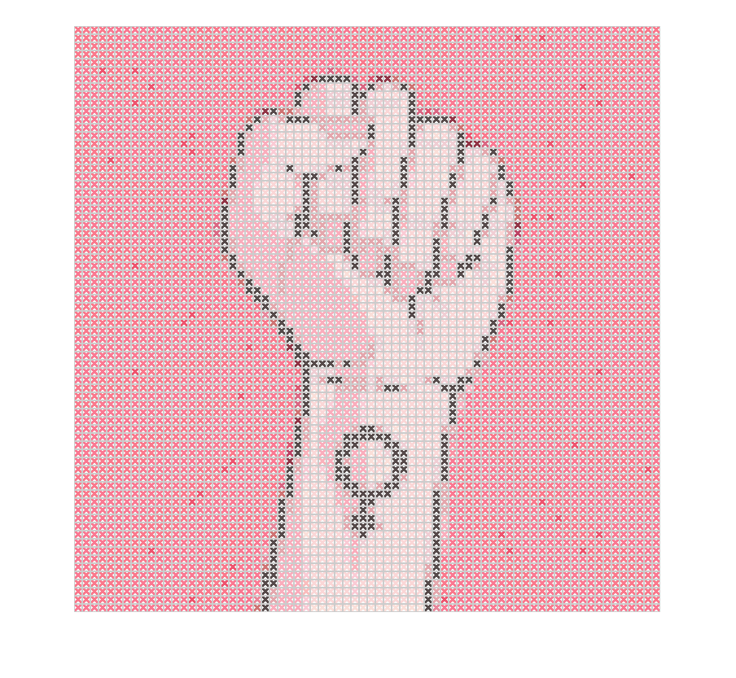

# Cross Stitch Generator
Matlab program that converts an image into a cross stitch pattern and outputs the correct colors to buy for the yarn. The algorithm is based upon the 453 existing DMC colors and converts them into RGB and further into Lab-values in order to compare the color difference. The algorithm can produce 4 different kind of reproduction, one with a free choice among the 453 colors, one with a reduced database of 100 colors, one with a further reduced database of 50 colors and finally one that chooses colors from the 50 most occuring colors in the image. 

```
Requires image processing toolbox.
```

# Examples using the program

The following images has been generated with a cross stitch width of 10x10 pixels. 

## Monet Cliff walk


## Illustration


